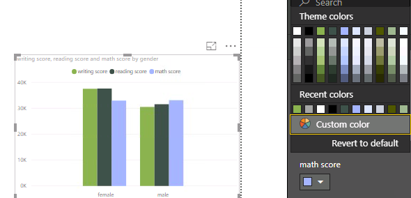

> “We don't make mistakes, just happy little accidents.”  - Bob Ross famous quote.
Image from biography.com


While I was growing up, I was in awe of my sister who can draw and paint. That skill isnt at all natural to me and I found that I am better with copy and paste! 

Twenty years later, here I am working with data and telling story with data is my life. It is a fun activity and therapeutic. I am often inspired by data artists in data visualisation communities such as:

* Jonni Walker (https://twitter.com/jonni_walker)
* Giorgia Lupi (https://twitter.com/giorgialupi)
* Nadieh Bremer (https://twitter.com/NadiehBremer)

But! I use PowerBI on day to day basis, I must have created tons of reports with the same looks and feels and I am curious if it is possible to incorporate color schemes based from pictures that I like.

I came across Power BI theme blog by [mssqltips.com]  (https://www.mssqltips.com/sqlservertip/5444/power-bi-layouts-and-themes/). 
<br>
It is possible that I can customise specific properties of my pbix files. All I need to do is specify these in a json format file which later can be used as PowerBI theme.

Good news! So I am going to approach this theme customisation into 3 steps:
<br>
1. Use R to extract Hex RGB codes from a select picture.
2. Write the R output into a json file.
3. Import theme into pbix file

# Joy of painting

picture from http://www.twoinchbrush.com


## Step 1 - Use R for hex codes
paletteR package isnt on CRAN so download it from source.

```r
devtools::install_github("AndreaCirilloAC/paletter")

library(paletter)
library(png)
library(tidyverse)
library(jsonlite)


download.file("http://www.twoinchbrush.com/images/painting291.png", "image.png")

painting     <- readPNG("image.png")


dimension    <- dim(painting)
painting_rgb <- data.frame(
  x = rep(1:dimension[2], each = dimension[1]),
  y = rep(dimension[1]:1, dimension[2]),
  R = as.vector(painting[,,1]), #slicing our array into three
  G = as.vector(painting[,,2]),
  B = as.vector(painting[,,3])
)

k_means        <- kmeans(painting_rgb[,c("R","G","B")], centers = 12, iter.max = 30)

show_col(rgb(k_means$centers))

rgb_df = rgb(k_means$centers) %>% as.data.frame() 

pbi_list <- list(
  name = "Mountain Lake",
  dataColors = rgb_df,
  background = "#FFFFFF",
  foreground = "#A4B690",
  tableAccent =  "#C3D4FE")


pbi_theme = jsonlite::toJSON(pbi_list, 
                             auto_unbox = T, 
                             pretty = T)
pbi_theme
```

## Step 2 - Write the R output into a json file.
I tried using jsonlite 's function toJson to output the file but I found that it didnt render the file the way I wanted so I simply used writeLines base R function instead. It allowed me to import this theme file into PowerBI without any errors.

```r
fileConn<-file("lake.json")
writeLines(pbi_theme, fileConn)
close(fileConn)
```

## 3. Import theme into pbix file
Referring to the blog by mssqltip.com above, you can navigate to json file previously created.





Voila! PowerBI + R = Awesome.

Hope you enjoy this blog. 
