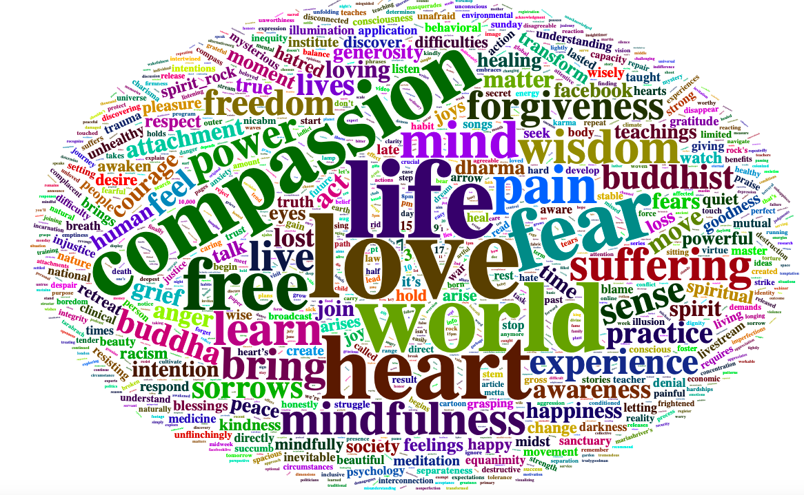

> “If your compassion does not include yourself, it is incomplete.”
<br>
> Jack Kornfield

I was raised a buddhist. Mindfulness and Loving Kindness is a core discipline of Buddhism. 
Jack Kornfield is one of my favourite zen masters. I turned to mindfulness and loving kindness to help improve my mental health. And when the days are hard, I often remind myself of Jack's words of wisdom.

[@jackkornfield](https://twitter.com/jackkornfield)


## Understanding Mindfulness and loving kindness

I scraped Jack Kornfields tweets using R.

```r
library(rtweet)
library(tidyverse)
library(qdapRegex)


result <- get_timeline("JackKornfield"
        , n = 1000
        ,  parse = TRUE
        , include_rts = FALSE
        , retryonratelimit = TRUE) 

headresult)

clean_result = result$text %>% 
        as_tibble() %>% 
        distinct()

clean_result$value = rm_url(clean_result$value)
clean_result$value = rm_hash(clean_result$value)

clean_result$nchar = nchar(clean_result$value)
clean_result = clean_result[which(clean_result$nchar>0),]
clean_result$nchar = NULL

clean_result[!grepl("^Image", clean_result$value), ] %>% as_tibble() -> clean_result


jack_kornfield_quotes = write.csv(clean_result, "jack_kornfield.csv", row.names = F)

#upload to googlesheet
gs_upload("jack_kornfield.csv", "jack_kornfield_quotes.csv", overwrite = T)


```

## Visualisation - Having a look at word frequency

```r
library(tidytext)
library(wordcloud2)


freq = result %>% 
    unnest_tokens(word, value) %>% 
    anti_join(stop_words) %>% 
    filter(word !="amp") %>%
    count(word, sort = TRUE)  

wordcloud2(freq)
```
<p>
  
</p>

## Alexa Skills

To help gaining access to Jack Kornfield's mindfulness and loving kindness' quotes, I developped Alexa Skills which can be found here. The codes can be found in my github repo.

https://www.amazon.co.uk/nujcharee-Jack-Kornfields-Quotes/dp/B07PGFH78K/ref=sr_1_1?crid=CR3EZOEGLW25&keywords=jack+kornfield&qid=1553857317&s=digital-skills&sprefix=jack+korn%2Calexa-skills%2C180&sr=1-1-catcorr

