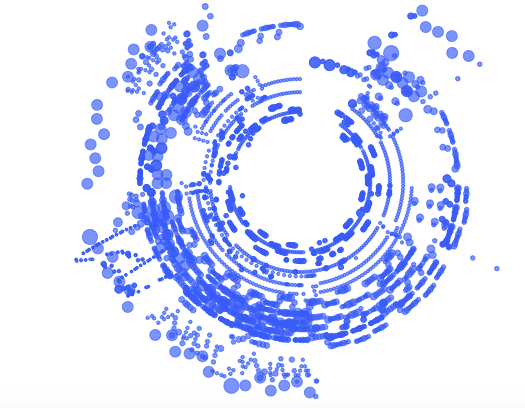
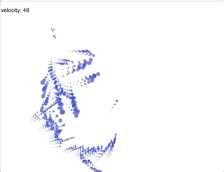

Nicholas Rougeux is one of my favourite data artists. 'Cos I am a PowerBI and a R nerd, I was curious if its possible that I can do something similar in PowerBI. At the time of writing this, I wasnt aware if there is a capability to read audio file directly from PowerBI.

I came across this website, the author of this article, [Henrik Lindberg](https://htmlpreview.github.io/?https://github.com/halhen/viz-pub/blob/master/mahler/code.html), and I shared something in common here, we both admire Nicholas Rougeux and we use R. I'm impressed by the author's tutorial on how to use ```tuneR``` package to extract midi files into tidy data.

I followed his tutorial in R but I chose a different midi file. 


## SPOILER ALERT - Turn off your speaker now or you will find yourself silently singing along.
<br>

So it is the start of the school holiday here in the UK, which means more family / fun time with my 5 year old son - who happens to love singing :) (Un)fornately the song he picked today was "Baby Shark"!!

<br>

[](https://youtu.be/XqZsoesa55w)

```r
# credit to the above tutorial by Henrik Lindberg

library(tuneR)
library(tidyverse)

# read baby shark midi file 


df.song <- readMidi('~/powerbi-blog/src/pages/scatterplot-midi-music/baby shark dance.mid')

df.tracks <- df.song %>%
  filter(event == 'Sequence/Track Name') %>%
  transmute(track, track_name = parameterMetaSystem)

df.notes <- getMidiNotes(df.song) %>%
  inner_join(df.tracks, by='track') 


df.notes %>%
  filter(time < 300000) %>%
  ggplot(aes(time, note + track/max(track), xend=time + length, yend = note + track/max(track))) +
  geom_segment(size=1) +
  theme_void()


df.notes <- df.notes %>%
  filter(track_name != 'perc' | note != 98)

# Visualising the plot
df.notes %>%
  mutate(angle = 2 * pi * time / max(time + 1),
         radius = 25 + 75 * (note - min(note)) / (max(note) - min(note)),
         size = 5 * sqrt(length / max(length))) %>%
  ggplot(aes(radius * sin(angle), radius * cos(angle), size=size)) +
  geom_point(color="#356DF0", alpha=0.7) +
  theme_void() +
  scale_size_identity() +
  coord_equal()
```

## My Baby Shark ```r ggplot ``` style
[


## Let's make it more animated - just like the song!

```r
# Create a new data frame "baby_shark_df" for later use.

df.notes %>%
  mutate(angle = 2 * pi * time / max(time + 1),
         radius = 25 + 75 * (note - min(note)) / (max(note) - min(note)),
         size = 5 * sqrt(length / max(length)))  -> baby_shark_df

# a plot object

p = baby_shark_df %>% ggplot(aes(radius * sin(angle), radius * cos(angle), size=size)) +
  geom_point(color="#356DF0", alpha=0.7) +
  theme_void() +
  scale_size_identity() +
  coord_equal()

library(gganimate)

# this is the library to make an animation.

  p + transition_time(velocity) +
  labs(title = "Rhythm of baby shark: {frame_time}")

```

[

<br>

## PowerBI visualisation

You can visualise a similar visualisation like static ggplot above using standard PowerBI's scatterplot.
I have done something similar here.

<iframe width="1140" height="541.25" src="https://app.powerbi.com/view?r=eyJrIjoiZTFhMTljZjQtZjU4Ni00ZmNmLWFmNDItNWVkNmFiNDFlMTc0IiwidCI6ImFkM2Q5YzczLTk4MzAtNDRhMS1iNDg3LWUxMDU1NDQxYzcwZSIsImMiOjh9" frameborder="0" allowFullScreen="true"></iframe>


